# The Storage Apocalypse

*AITU, Introduction to Bioinformatics, Project 09. Every number below comes from a file in
`results/` that `make repro` regenerates from public data.*

## Summary

**Question.** Sequencing output has grown faster than storage has become cheaper. When does
keeping sequence data cost more than producing it, and what can compression and tiering do
about that date?

**Answer.**

* **The curves cross about now.** Take the SRA as it stores data today: 0.34 bytes per base,
  three INSDC copies (NCBI, ENA, DDBJ), priced at the cloud list price. Keeping a newly
  sequenced megabase for 10 years already costs 0.78× its sequencing cost (2022, median). The
  crossover falls in 2023 (median; 90% range 2022–2036; 77% probability by 2030).
* **Practice moves the date.** Lossless FASTQ-specific compression moves it to 2027.
  Compression plus 2-level quality binning, which we show costs no SNP accuracy in a haploid
  genome, moves it to 2029. Adding reuse-based tiering moves it to 2035.
* **The sequencing-price trend moves it most.** If sequencing keeps its 2015–2022 pace instead
  of its 2008–2022 pace, the fully optimised archive does not cross before 2060.

Section 1 shows what an experiment stores, sections 2–3 how fast archives and instruments
grow, sections 4–7 what compression, binning, long reads, searchability and tiering buy, and
section 8 puts it into one dated projection.

## 1. Biological setting: what a sequencing experiment stores, and what is irreplaceable

A sequencing experiment is a chain of transformations. Each step makes the data smaller and
more interpreted, and each step can, in principle, be redone from the step before it. Only the
first step cannot:

| stage | example form | bytes per base (measured, §4–6) | 30× human genome (90 Gb) | replaceable from |
|---|---|---|---|---|
| biological sample | DNA extract, tissue, isolate | – | – | **nothing**: an outbreak isolate, biopsy or extinct population exists once |
| raw instrument signal | Nanopore POD5 | 11.5 | ~1,040 GB | re-sequencing the sample |
| reads with qualities | FASTQ.gz | 0.52 | 46 GB | re-basecalling the signal (if kept) |
| | SRA archive format (all of SRA) | 0.34 | 31 GB | |
| | Spring, lossless | 0.10 | 9.0 GB | |
| | Spring, no qualities | 0.036 | 3.3 GB | |
| alignments | BAM / CRAM 3.1 | 0.26 / 0.092 | 24 / 8.3 GB | reads + reference + aligner version |
| variants, assemblies | VCF, FASTA | small | < 1 GB | reads + software |

*Bytes per base were measured on bacterial data at 86× coverage (§4–6). Human data compress
differently, so the human column shows orders of magnitude, not a quote.*

**What is irreplaceable.** In practice, the reads are what must be kept. They are the last form
from which every downstream question can be re-asked: a new reference genome, a better variant
caller, a pathogen not known when the data were made. Everything after the reads can be
recomputed. The signal can be regenerated only by re-sequencing, and it is worth keeping only
while it can still improve the reads (§5). The reads themselves are replaceable only if the
sample still exists and can be re-sequenced. For a cell line or a model organism, that is a
real alternative to storage. For a clinical sample, a historical outbreak or a wild population,
it is not.

This is why the crossover in §8 matters biologically. Once storing a base costs more than
sequencing it, "delete and re-sequence later" becomes the rational policy for renewable
samples. At the same time, the irreplaceable fraction has to be protected by compression and
tiering instead.

## 2. Data sources and archive growth

**Sources for sections 1–3 and 9** (full provenance in `results/tables/downloads.tsv` and
`config/accessions.tsv`):

* GenBank release notes 273.0 (`gbrel.txt`, NCBI FTP): base and entry counts per release,
  1982–2026.
* NCBI SRA database statistics (`sra_stat.cgi`): daily size in bases and bytes, 2007 to
  February 2024.
* NHGRI *DNA Sequencing Costs: Data* (May 2022 table).
* Our World in Data, historical disk prices (constant 2020 USD per TB).
* The AWS S3 price list.
* ENA Portal API run counts per platform and year.
* Vendor specification sheets for 15 instruments (`config/instruments.tsv`, with URLs).

**Problems found in the archives' own statistics.**

* *GenBank.* gbrel.txt prints release 272 as June 2026 in the GenBank and WGS tables but April
  2026 in the TSA and TLS tables. The parser keeps the GenBank-table date and records the
  correction in the row's `note`. The header totals were cross-checked against the last table
  rows.
* *SRA.* NCBI's statistics end on 25 Feb 2024 and have one gap longer than a month
  (`sra_growth_issues.tsv`). Its own byte and base totals give 0.34 bytes per stored base; we
  use this as "what the SRA stores today".
* *ENA.* Run release dates start only in 2010, and a single bulk metadata request was silently
  truncated (§7).

**Growth.** SRA held 91.2 Pbases (31.4 PB) in February 2024. Its growth is slowing. The archive
multiplied 4–5× a year in 2009–2012, about 1.5× a year in 2014–2019, and 1.2× a year in
2022–2023. Since 2020 the yearly intake has been roughly constant at 12–15 Pbases. GenBank's
traditional division went the other way: 0.39 Tbases in 2019, 8.2 Tbases in 2026.

**Three functional forms, and how much the choice matters (task 2, Figure A1,
`growth_fits.tsv`).** Each archive was fitted from 2012 (GenBank) or 2014 (SRA) with:

* *exponential*: constant doubling time;
* *linear*: constant yearly intake;
* *logistic*: growth saturating at some size.

Each form was also backtested: we hid the last five years, refitted, and compared the forecast
with what actually happened.

| archive | form | in-sample AIC | backtest: forecast / actual at the end | size in 2045 vs today |
|---|---|---|---|---|
| SRA (bases) | exponential | −560 | 4.3× too high | **7,600×** |
| | linear | 318 (poor early fit) | 0.46× | **3.0×** |
| | logistic | **−844** | 4.3× too high | **1.1×** |
| SRA (bytes) | exponential | −648 | 2.9× | 1,160× |
| | logistic | **−972** | **1.4×** | 1.2× |
| GenBank WGS | exponential | −477 | 1.9× | 1,440× |
| | logistic | **−571** | 1.9× | 1.7× |
| GenBank traditional | exponential (= logistic) | −306 | 0.16× (6× too low) | 129× |

The projection depends almost entirely on the model. For 2045, the SRA is anywhere from 1×10¹⁷
bases (logistic) to 7×10²⁰ (exponential), a 7,000-fold spread. The data cannot settle the
choice, because every form missed its backtest by 2–6× in at least one archive: these archives
change regime faster than five years. The logistic form fits SRA best in-sample, and the linear
form matches the recent constant intake. The exponential is the scenario in which the
"apocalypse" happens. We therefore do not project storage demand from archive size. The
crossover in §8 is computed per sequenced base, which needs no volume forecast at all.

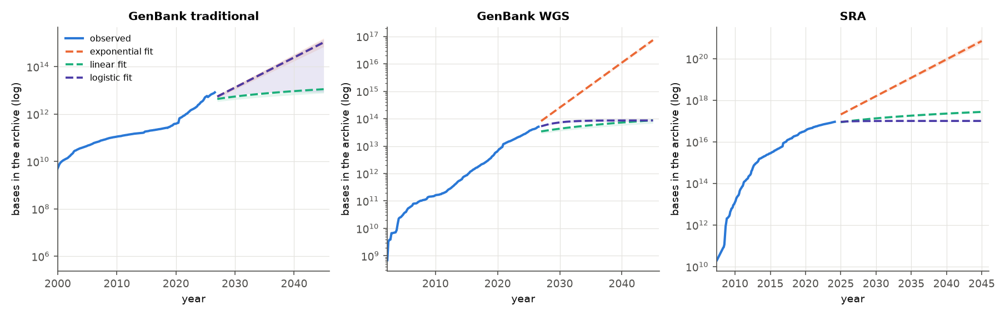{width=88%}\
*Figure A1. Size of GenBank's traditional and WGS divisions and of the SRA (bases, log scale), with the three fitted forms projected to 2045; shading is the 5–95% residual-bootstrap band (parameter uncertainty only).*

## 3. Platforms and throughput

**Capacity per instrument (`instruments.tsv`, `instrument_capacity_fit.tsv`).** Vendor-stated
maximum output per run, divided by run time, gives Gb per instrument-day. Across eight Illumina
flagships, capacity rose from 0.33 Gb/day (Genome Analyzer, 2006) to 8,000 Gb/day (NovaSeq X
Plus, 2023). That is 24,000× in 17 years, a doubling every 1.2 years, roughly four times as
fast as disk prices halve (5.2 years, §8). Long-read capacity has caught up in volume but not
in accuracy:

* a PromethION 48 delivers ~4,600 Gb/day, more than a NovaSeq 6000 (3,300);
* a PacBio Revio delivers 360 Gb/day of HiFi reads.

**What each platform makes possible, and impossible.** The platforms produce different data,
not just different amounts of it (§5):

* *Illumina* reads are short (2×150–251 bp) and accurate. Errors are 0.35% substitutions with
  almost no indels. They cannot span repeats longer than a fragment.
* *Nanopore* reads are 10–100 kb with ~3% error, two thirds of it indels in homopolymers. Their
  primary data (signal) is 12–15× larger than the reads, and it can be re-read later.
* *PacBio HiFi* sits in between: long and accurate, at lower throughput.

**What the community actually runs (ENA run counts; Figure A2 in the appendix).**

* Illumina's share of public runs rose from 57% in 2010 (when 454 still had 35%) to 90–96%
  since 2016.
* Nanopore and PacBio together reached 4–9% of runs from 2021.
* DNBSEQ/BGISEQ reached 4% in 2025.
* Public runs per year grew from 80,000 (2010) to a peak of 6.5 million (2022), the
  pandemic-surveillance peak, and have since settled at 5–5.3 million.

**Aggregate output (`sra_intake_vs_capacity.tsv`).** Divide the SRA's yearly intake by the
capacity of the newest Illumina flagship. The 12–15 Pbases a year deposited in 2020–2023 equal
the output of only 5–12 flagship instruments running all year. Thousands are installed. The
public archive therefore receives a small fraction of world sequencing output: most clinical,
commercial and agricultural data are never deposited. Archive growth is a lower bound on
global output, and its slowdown (§2) may reflect deposition policy as much as sequencing
activity.

## 4. Short reads: compression and quality binning

**Question.** A FASTQ record has three parts: a read name, the bases, and one quality score per
base. Only the bases carry the biology. The quality scores carry the instrument's confidence,
and variant callers use them to weigh evidence. If quality scores make up most of an archive's
bytes, the cheapest saving is also the one most likely to damage later analyses. We measured
both sides of that trade on one real run.

**Data, and two problems found in the archive.** Illumina paired-end run SRR25629153
(*E. coli* K-12 MG1655, BioSample SAMN36977599): 832,053 pairs of 251 bp, 400 Mb, ~86× of the
4.64 Mb genome. The archives hold two different copies of this run.

* NCBI's *SRA Normalized* file (141 MB, MD5 from the SRA run record). We decoded it with
  `fasterq-dump`. Its qualities take only four values (Q2, Q11, Q25, Q37; 90.7% of bases
  are Q37). The instrument itself had already binned them.
* ENA's FASTQ (148 MB). Every quality in it is `?` (Q30). This is *SRA Lite*: the archive
  replaced all qualities with one constant. Nothing in the ENA record says so. We found it
  from the quality histogram, after seqkit reported exactly 100% Q30 bases.

The metadata also contradicts the data. SRA records the instrument as *Illumina HiSeq 4000*,
but the read names carry flow-cell ID `HWFV2DRXY`, a NovaSeq flow-cell pattern. 2×251 reads
with 4-level qualities are also a NovaSeq signature. We interpret the run as NovaSeq and keep
the conflict on record (Limitations). Either way, an archive user asking "what qualities does
this run have?" gets three answers: none (ENA), four levels (NCBI), and the instrument's
original values, which no longer exist anywhere.

**QC (fastp 1.3.7).** Adapters were detected per pair (only 774 reads carried any). 3' ends
were trimmed below Q20, the quality decay of the last cycles. Reads were dropped with >40% of
bases below Q15 (344 reads) or if shorter than 50 bp after trimming (18,188 reads), because
shorter fragments map ambiguously across the ~5 kb rRNA operon repeats. Duplicates (5.1%) were
removed. Of 1,664,106 reads, 1,560,708 remained (90.1% of bases ≥Q30). Raw reads aligned to
MG1655: 99.90% mapped, 99.69% properly paired, 99.999% of the genome covered at 86×.

**Where the bytes are (Figure B2 in the appendix).** We compressed the three FASTQ streams separately (zstd -19). For
Illumina, read names make up 10% of the compressed bytes, bases 56% and qualities 34%. For
Nanopore, qualities make up 78% (§5). On this run qualities are "only" a third, because the
instrument already reduced them to four symbols. Where qualities still take ~40 values, as in
the Nanopore run, they dominate the archive.

**Compression benchmark (Figure B1; all codecs in Table S1).** Every codec ran on the same
uncompressed FASTQ (1.03 GB). We timed each run with GNU `time`, with nothing else running.
Every output was decompressed and compared with the input by MD5; for Spring, the read-name
copy that `fasterq-dump` repeats on the `+` line was ignored, because Spring stores names once.

* gzip, the format archives serve, reaches 4.98× (4.13 bits/base).
* zstd -3 is two orders of magnitude faster (2,282 MB/s) but no smaller.
* xz and zstd -19 reach ~7.3×. A 128 MB matching window (`zstd --long`) reaches 12.3×,
  because at 86× coverage each genome position recurs in ~86 reads.
* Spring, a FASTQ-specific compressor that reorders reads so overlapping ones sit together,
  reaches **25.7× (0.80 bits/base)**: 5× smaller than gzip and ten times faster than zstd -19.
  It costs 1.8 GB of memory, has slow decompression (104 MB/s) and gives no random access (§6).

On top of Spring, quality binning takes the archive from 0.81 bits/base to 0.49 (2 levels)
and 0.29 (no qualities). ENA's SRA Lite copy compresses to 0.24 bits/base: a whole bacterial
run in 11.8 MB. Aligned, the same reads take 105 MB as BAM and 36.7 MB as CRAM 3.1, because
CRAM stores only the differences from the reference.

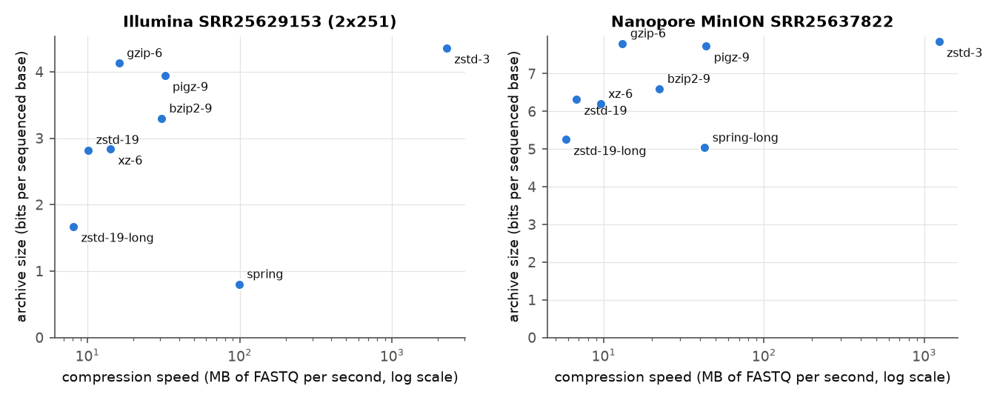{width=88%}\
*Figure B1. Archive size (bits per sequenced base, lower is better) against compression speed (MB of uncompressed FASTQ per second, log scale) for each codec; left Illumina, right Nanopore. Every point passed a lossless round-trip check.*

**Quality binning and what it costs (Figure B3, `variant_benchmark.tsv`).** Five versions of
the QC'd reads were written: the original 4 levels, Illumina's 8-level map, a 4-level map, a
2-level good/bad flag, and no qualities (all Q30, as in SRA Lite). Each was subsampled to 5×,
15×, 30× and full depth with a fixed seed, aligned to *E. coli* B REL606 (bwa-mem2 2.3) and
called with bcftools 1.24 (`mpileup -q20 -Q13 | call -mv --ploidy 1`; a bacterium is haploid).

The truth set does not come from reads at all. We aligned the finished MG1655 genome to the
finished REL606 genome (minimap2 `asm5`). paftools.js then called the differences inside
one-to-one alignment blocks of at least 10 kb: 25,952 SNPs and 354 indels over 4.02 Mb of
"confident" sequence. Reads from a K-12 strain aligned to REL606 must rediscover exactly these
differences. This gives an answer key that is large and independent of the platform. Its
known weakness: the sequenced strain is a laboratory derivative of MG1655, so its own few
private mutations count as false positives, equally in every callset.

Result:

* At 15×, 30× and full depth, no binning scheme, including discarding the qualities
  altogether, changes SNP F1 by more than 0.001. At full depth all schemes find 25,702–25,703
  of 25,952 true SNPs with 237–240 false positives (F1 0.9906).
* Only at 5× does information loss show, and it shows in score calibration rather than in the
  calls themselves. Without a QUAL filter, the no-quality calls fall from F1 0.9665 to 0.9506,
  because bcftools gives Q30 to every error and false calls stop looking weak. At the usual
  QUAL ≥20 filter, the difference disappears (0.9220 vs 0.9265).
* Indel F1 (~0.72) is limited by the aligner and caller, not by the qualities.

This is a negative result, and an important one. For haploid SNP calling at normal depth, the
quality stream is close to dead weight: 34% of this archive (78% for Nanopore) buys almost
nothing. Where it would matter (low depth, mixed or somatic samples, diploid heterozygous
calls, base-quality recalibration), this experiment cannot speak (Limitations).

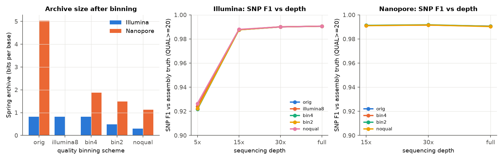{width=88%}\
*Figure B3. Left: Spring archive size per sequenced base under each quality-binning scheme. Middle and right: SNP F1 against the assembly-derived truth set (QUAL ≥20) by sequencing depth; the y axis is the same in both panels.*

## 5. Long reads and the raw signal

**Long-read data.** Nanopore MinION run SRR25637822 comes from the same BioSample: 41,926
reads, 587 Mb (~127×), N50 15.2 kb, median Q15.9 (NanoPlot). Short-read QC does not transfer.
There are no fixed-position adapters, duplicate rates mean nothing for single molecules, and a
per-base Q20 cut would discard 26% of the bases. We filtered on length ≥1 kb and mean quality
≥Q10. Nothing was removed: the shortest read is 5,063 bp, so the submitter had already
filtered, which the metadata does not say.

**Error profiles, measured rather than assumed (`error_profile_*.tsv`; Figure B4 in the
appendix).** Raw reads of both platforms were aligned to MG1655, and every alignment was walked
base by base (200,000 Illumina and 20,000 Nanopore reads, reservoir-sampled).

| | Illumina | Nanopore MinION |
|---|---|---|
| identity (matches / aligned columns) | 99.64% (Q24.5) | 96.97% (Q15.2) |
| median per-read identity | 100% | 97.5% |
| mismatches per 100 aligned bases | 0.354 | 1.056 |
| inserted bases per 100 | 0.002 | 0.730 |
| deleted bases per 100 | 0.001 | 1.241 |
| indels as share of errors | 0.8% | 65.1% |
| indel events in homopolymers ≥4 | 29% (of very few) | 16.5% |
| genome inside homopolymers ≥4 | 5.9% | 5.9% |

The two platforms fail differently. Illumina errors are substitutions; it practically never
gains or loses a base. Nanopore makes three times more substitutions, but two thirds of its
errors are deletions and insertions. Indel events are enriched in homopolymers (16.5% of events
vs 5.9% of the genome): the pore cannot count identical bases passing through it. This is why
indel calling from these reads stays poor (F1 0.54) while SNP calling does not (below).

**Variants from long reads.** Reads were aligned with minimap2 2.31 (`-x map-ont`: k=15 seeds
and gap costs for indel-dominated errors) and called with bcftools' Nanopore preset
(`-X ont-sup-1.20`). Against the same truth, SNP F1 is 0.9905, the same as Illumina's 0.9906
but reached the other way round:

* recall is higher (99.60% vs 99.04%), because 15 kb reads span repeats;
* precision is lower (98.52% vs 99.08%).

At 15× Nanopore still reaches F1 0.991, so the run could be subsampled 8× with no loss for
this purpose.

**Compression of long reads (`compress_ont.tsv`, Table S2).** gzip reaches only 2.06× and the
best codec, Spring in long-read mode, 3.18× (5.03 bits/base, against 0.80 for Illumina). The
reason is the quality stream. Nanopore qualities take ~40 values that vary base to base, and
they make up 78% of the compressed bytes. (2.8% of the bases carry an implausible Q90, an
unexplained placeholder that we left untouched.) Binning them is where the savings are:

| Nanopore qualities | Spring bits/base | archive size vs original | SNP F1 at full depth |
|---|---|---|---|
| original (~40 levels) | 5.03 | 1.00× | 0.9905 |
| 4 levels | 1.88 | 0.37× | 0.9906 |
| 2 levels | 1.49 | 0.30× | 0.9905 |
| none | 1.13 | 0.22× | 0.9903 |

Reducing Nanopore qualities to four levels shrinks the archive 2.7× with no measurable change
in SNP calls. This is the largest saving per unit of biological risk in the whole project.

**The raw signal: can it be deleted after basecalling? (Figure B6 in the appendix).** A
Nanopore run's primary data is the ionic-current trace (POD5), from which a neural network
infers the bases. We used one real POD5 file from ONT's open plasmid dataset (`plasmid_2025.04`,
R10.4.1, 54,946 reads, 2.06 GB).

* *Already compressed.* The file holds 2.45 billion samples. POD5's VBZ codec stores them at
  6.74 bits per sample (2.37× smaller than raw int16), and zstd -19 gains only 0.16% more.
* *Large.* Whole public datasets hold 5.7–6.9× more bytes of signal than of uncompressed
  basecalls (272.5 vs 47.9 GB; 273.1 vs 39.5 GB). Per base, signal takes 11.5 bytes against
  0.77–0.95 for gzipped FASTQ: 12–15× more.
* *Worth re-reading.* The same 20,000 reads were basecalled twice with dorado 1.4.0 on a
  consumer GPU: the fast "hac" model and the slower "sup" model. Accuracy was scored against
  the known plasmid sequences.

| | hac | sup |
|---|---|---|
| median per-read identity | 98.73% | **99.47%** |
| mismatches per 100 aligned bases | 0.82 | 0.45 |
| deleted bases per 100 | 1.92 | 1.67 |
| GPU time for 20,000 reads | 57 s | 308 s (5.4×) |

Re-reading the *same* signal with a better model removes 58% of a typical read's errors
(median error 1.27% → 0.53%). FASTQ freezes what the basecaller knew on the day it ran.

**Recommendation.** Keep signal for reference, clinical and novel-organism samples. For
routine resequencing, keep it in deep archive until the next major basecaller has been applied
(a year of a 2 GB file costs $0.02 there), then delete it.

## 6. Alignment as an index: is a compressed archive still searchable?

**Question.** Compression only helps if people can still find things in the archive. We stored
the same Illumina run in six forms and asked each one the same questions
(`bench_search.py`, three repeats, median wall time, nothing else running):

* find every read that comes from one gene (*lacZ*, NC_000913.3:363,231–366,305);
* fetch reads from 200 random 1 kb windows;
* read every record.

For the FASTQ forms there are no coordinates, so we scanned for the gene's 31-mers on both
strands (154 k-mers × 2, GNU `grep -F`, one pass). BLAST searched a database built from the
reads (`blastn`, E < 1e-20). Recall is measured against the reads that the aligned BAM places
on the gene.

| storage form | bits/base | gene query | recall | random 1 kb region | full scan |
|---|---|---|---|---|---|
| FASTQ.gz (fasterq-dump, pigz) | 4.13 | 5.27 s | 0.982 | not possible | 2.50 s |
| FASTQ.zst (-19) | 2.82 | 5.20 s | 0.982 | not possible | 0.83 s |
| Spring | 0.80 | 15.4 s | 0.982 | not possible | 10.2 s |
| BAM (sorted, indexed) | 2.10 | **0.006 s** | 1 (reference) | 4.8 ms | 0.26 s |
| CRAM 3.1 | **0.73** | 0.015 s | 1.000 | 6.3 ms | 0.10 s |
| CRAM 3.1 archive profile | 0.70 | 0.34 s | 1.000 | 32 ms | 0.15 s |
| BLAST database of reads | 7.28 | 0.15 s | 0.972 | not possible | – |

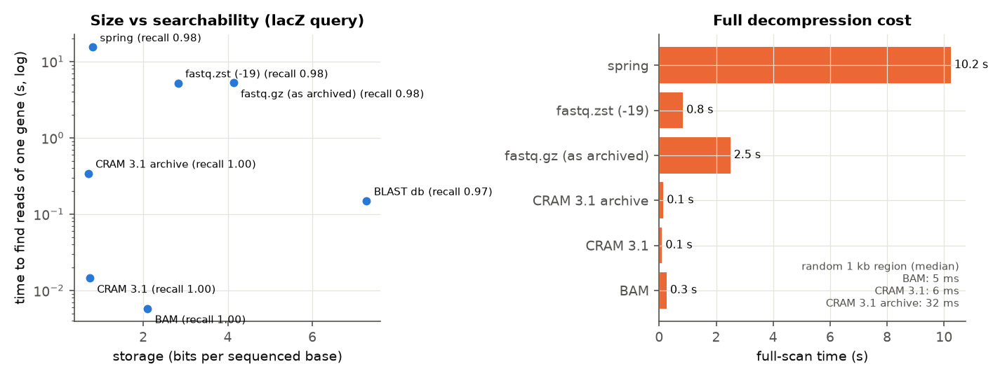{width=88%}\
*Figure B5. Left: storage per sequenced base against the time to retrieve the reads of one gene (log scale), with recall against the BAM answer. Right: time to read every record in each form.*

**Interpretation.**

* *An alignment is the index.* CRAM is the smallest form we measured, smaller even than Spring
  (0.73 vs 0.80 bits/base), because it stores only differences from the reference. It also
  answers a gene query in 15 ms, 360× faster than scanning any compressed FASTQ.
* *Index lookup vs scan.* CRAM, like BAM, keeps an index of genome coordinates (`.crai`) and
  decodes only the blocks it needs. Reading a random 1 kb window costs 6 ms in CRAM against
  5 ms in BAM: random access survives compression.
* *Where the costs hide.* The "archive" CRAM profile buys 5% fewer bytes for 5–20× slower
  queries. Spring is excellent for cold storage but has no random access: every question costs
  a full 10 s decompression.
* *BLAST.* The heuristic seed-and-extend search over an indexed word list is 35× faster than
  scanning FASTQ, but the database is the largest form here: it keeps sequence headers and
  lookup tables, and no qualities. It is a search accelerator, not an archive.
* *Recall.* The k-mer scan misses 1.8% of the gene's reads: those overlapping its ends by fewer
  than 31 bases, which an exact k-mer cannot see. BLAST misses 2.8%: short overlaps fail the
  E-value cutoff. Both algorithms trade sensitivity at the edges for speed, and the alignment-
  based answer is the only exact one.

The trade-off for an archive follows directly. Data that will be queried should be kept as
CRAM against a stable reference. FASTQ in a FASTQ-specific compressor suits data that will be
restored whole if at all. The catch with CRAM is that the reference becomes part of the
archive, and losing it makes the data unreadable.

## 7. Tiering: which data can go cold?

**Question.** Most archived sequencing data is never read again, but nobody knows *which* data
in advance. A tiering policy has to decide at submission time, from metadata alone, which
studies can go to deep storage (cheap, but hours to restore) and which must stay
instantly readable.

**Reuse signal.** SRA and ENA publish no download counts, so the next best public signal was
used: papers that mention the study. Europe PMC was queried for every *E. coli* BioProject
and its SRP/ERP alias, by text-mined accession and by literal string. A study counts as
**reused** if at least two papers mention it within the year before to four years after its
release. One paper is usually the submitters' own; the fixed window stops old studies from
looking "reused" just because they had more years to be cited.

**Data at scale.** The complete ENA run table for *E. coli*: 607,211 runs, 0.27 PB of FASTQ, 9,875 studies, downloaded in yearly chunks verified against ENA's own counts (details in the appendix). The 5,748 studies released 2010–2021 (155 TB) were labelled with 11,497 Europe PMC queries. 30% of them are mentioned in at least one paper, and 8.0% are reused.

**Who gets reused (`tiering_reuse_by_group.tsv`, Figure B7).**

* Reuse rises steeply with release year: 0.7% for 2012 studies and 9–12% for 2019–2021 studies.
  Part of this is real, as surveillance-era data is analysed more. Part is a measurement
  artefact: citing BioProject accessions in papers became common only after ~2014.
* Long-read studies are cited more often than Illumina ones (45% and 39% vs 28% cited at
  least once) but are 7% of the bytes.
* Whole-genome shotgun data is 85% of the bytes.

**Model.** Only features known at submission are used: volume, runs, samples, bytes per run,
platform and paired-end shares, library strategy and source, instrument model, submitting
centre (categories learned on training years only) and release year.
Validation is temporal, as in real use: we fitted on studies released ≤2017 (3,021 studies,
3.4% reused) and tested on 2018–2021 (2,727 studies, 9.0% reused).

| model | test ROC-AUC | test PR-AUC |
|---|---|---|
| logistic regression (class-balanced) | **0.752** | 0.224 |
| gradient boosting | 0.709 | 0.204 |
| study size only | 0.711 | 0.226 |
| random | 0.493 | 0.093 |

The logistic model beats chance clearly, but much of its signal is size: large consortia and
surveillance programmes get reused. Gradient boosting overfits the training years, whose reuse
rate is a third of the test years'. The strongest coefficients are submitting centres (for
example NISC, odds ratio 7.9): proxies for public-health programmes, not causes.

**Cost (`tiering_costs.tsv`).** Each policy was priced on the 75 TB of test-year studies over
5 years at AWS list prices, which the script re-checks against the downloaded price list.
Every reuse after the first paper is charged as one full read of the study.

| policy | 5-year cost (USD) | saving vs S3 Standard | reuse requests delayed |
|---|---|---|---|
| all S3 Standard | 103,395 | 0% | 0% |
| all Glacier Instant Retrieval | 19,131 | **81.5%** | 0% |
| all Deep Archive | 4,546 | 95.6% | 100% |
| age rule: Standard 24 months, then Deep Archive | 44,106 | 57.3% | 73% |
| model: Deep Archive if p < 0.61, else Instant Retrieval | 17,094 | 83.5% | 17% |
| oracle (knows future reuse) | 8,446 | 91.8% | 0% |

Three conclusions follow, and the first one was not what we expected.

1. *The first decision is not hot vs cold.* Moving everything from S3 Standard to an instant-
   access archive tier saves 81.5% and delays nobody. Retrieval fees are negligible at the
   observed reuse rate ($1,149 over 5 years).
2. *The common age rule is the worst option.* Keeping data hot for two years costs 2.3× more
   than the instant archive and still delays 73% of reuse, because reuse arrives late
   (papers come 1–4 years after release).
3. *Prediction buys real but limited extra savings.* The model's threshold was chosen on the
   training years as the cheapest one that delays ≤10% of reuse. On the test years it saves a
   further 10.7% over all-Instant-Retrieval, but delays 17% of reuse requests: the training
   years reused data three times less, so the threshold is miscalibrated for the future. The
   oracle shows the ceiling: 79% of the test bytes are never reused, and knowing which would
   save 56% more than all-Instant-Retrieval. Better reuse signals (real download logs) are
   worth more than a better model.

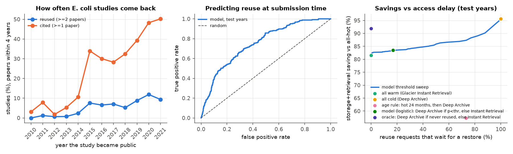{width=88%}\
*Figure B7. Left: share of E. coli studies mentioned in ≥1 and ≥2 papers within the fixed window, by release year. Middle: ROC curve of the logistic reuse model on the held-out years 2018–2021. Right: total 5-year cost saving against the share of reuse requests that must wait for a Deep Archive restore; the line sweeps the model's threshold, points are the fixed policies.*

`tiering_savings_for_forecast.tsv` passes this saving (83.5% of archive storage cost) to the
crossover model, where it is the last of the storage scenarios in §8.

## 8. Headline projection: when does storage overtake sequencing?

**The two price curves (Figure A3, `price_fits.tsv`).**

* *Sequencing* (NHGRI cost per raw Mb) fell 37% a year over the second-generation era
  (2008–2022, cost halving every 1.5 years), but only 20% a year since the HiSeq X / NovaSeq
  plateau (2015–2022, halving every 3.2 years). Both readings are defensible, and they imply
  very different futures.
* *Disk prices* (2013–2023) fell 12.6% a year, halving every 5.2 years.

Since 2015 the gap between the two rates has shrunk from 3.0× to 1.6×. That convergence is
what decides the crossover.

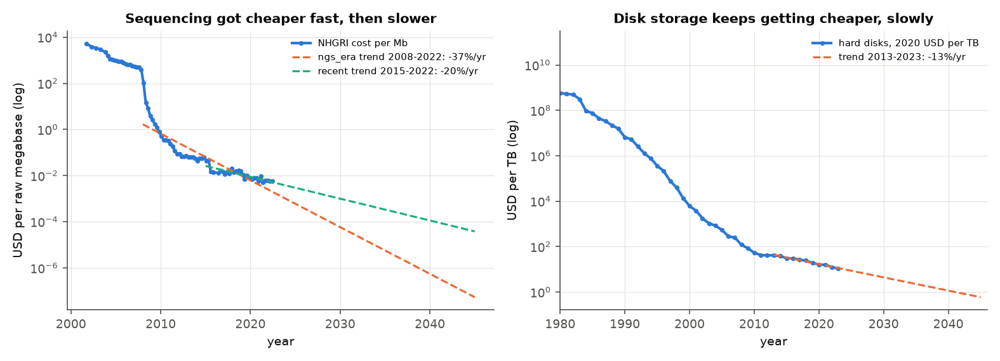{width=88%}\
*Figure A3. Left: NHGRI sequencing cost per raw megabase (log scale) with the two fitted trends extended to 2045. Right: hard-disk price per TB in constant 2020 USD (Our World in Data) with the 2013–2023 trend.*

**Model (`project_crossover.py`).** Both costs are compared per sequenced megabase.

* *Sequencing cost* in year *t* is the fitted NHGRI trend.
* *Storage cost* is bytes per base × number of copies × the sum over 10 years of the price per
  GB-month. The price starts at today's AWS S3 Standard list price ($0.023/GB-month, AWS price
  list effective September 2026) and falls at the fitted disk-price rate.
* The *crossover* is the first year in which the 10-year storage cost of a newly sequenced Mb
  reaches its sequencing cost.
* *Uncertainty.* Each of 2,000 Monte Carlo draws picks one of the two sequencing readings at
  random and samples both trends' parameters by residual bootstrap. The reported range
  therefore covers the model choice as well as the fit noise.
* *Scenarios.* They change only what part B measured: bytes per base (Illumina, §4) and the
  tiering saving (§7).

| storage practice | bytes/base | ratio in 2022 (median) | crossover, median (5–95%) | P(by 2030) | P(by 2045) |
|---|---|---|---|---|---|
| SRA today, 3 copies, S3 Standard | 0.345 | 0.78 | **2023** (2022–2036) | 0.77 | 0.99 |
| FASTQ.gz with qualities | 0.516 | 1.16 | 2022 (2022–2029) | 0.97 | 1.00 |
| Spring, lossless | 0.100 | 0.23 | 2027 (2024–2053) | 0.52 | 0.77 |
| Spring + 2-level qualities | 0.061 | 0.14 | 2029 (2025–2056) | 0.52 | 0.64 |
| Spring + 2-level + tiering (−83.5%) | 0.061 | 0.02 | **2035** (2030–2057) | 0.03 | 0.52 |

| same, by sequencing trend | 2008–2022 pace resumes | 2015–2022 pace continues |
|---|---|---|
| SRA today | 2022 (2022–2023) | 2030 (2026–2039) |
| Spring, lossless | 2025 | 2045 |
| Spring + 2-level + tiering | 2032 (2030–2035) | not before 2060 in 85% of draws |

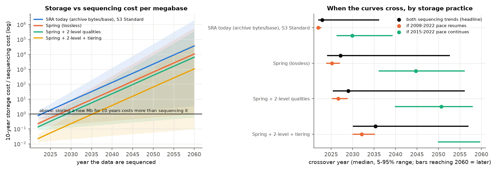{width=88%}\
*Figure A4. Left: ratio of the 10-year storage cost to the sequencing cost of a newly sequenced megabase (log scale; median and 5–95% band over 2,000 draws) for four storage practices; above 1, storing costs more than sequencing. Right: crossover year, median and 5–95% range, for each practice under the mixed (headline) and each single sequencing trend.*

**What changes the date (`crossover_sensitivity.tsv`).**

1. *The sequencing trend.* For current practice it moves the crossover by 8 years (2022 vs
   2030). For the optimised archive it moves it by decades. No storage decision is as large as
   this uncertainty.
2. *Compression.* Spring instead of the archive's format cuts bytes 3.4×, gaining ~4 years in
   the headline and ~15 years under the recent trend. Quality binning adds 2–6 years.
3. *Tiering.* Moving data into archive tiers by predicted reuse cuts the price 6× and gains
   another ~6 years.
4. *Copies and retention.* One copy instead of three gives 2027 instead of 2023. A 5-year
   instead of 10-year retention gives 2024.

**Interpretation.**

* *Storage now costs as much as sequencing.* At cloud list prices, a newly sequenced base
  costs about as much to keep for a decade as it cost to make. This holds unless sequencing
  stops getting cheaper faster than disks.
* *The "apocalypse" is a cost inversion, not a capacity limit.* The archives are not about to
  run out of space; their growth is slowing (§2).
* *Renewable samples can be re-sequenced.* For cell lines and model organisms, deleting reads
  and re-sequencing on demand is already a defensible policy.
* *Irreplaceable samples have to be stored.* For clinical, outbreak and environmental samples,
  the only lever is to make storage cheaper. The measured levers are lossless FASTQ
  compression (5×), quality binning where it is harmless (another 1.7×) and reuse-aware tiering
  (another 6×). Together they buy roughly a decade.

## 9. Conclusion

1. **The archives store less than they appear to, and do not say so.**
   * ENA serves our test run with every quality set to Q30.
   * The instrument had already reduced qualities to four levels.
   * The SRA records the wrong instrument model.
   * One bulk metadata request was truncated without an error.

   Every one of these was found only because the pipeline checks data against its own
   description.
2. **Most of the bytes buy little.**
   * Qualities are a third of a short-read archive and four fifths of a Nanopore one, yet
     dropping them changed SNP F1 by ≤ 0.001 at normal depth.
   * Raw signal costs 12–15× the reads but improves accuracy by re-basecalling (58% fewer
     errors). It is worth keeping only until the next basecaller.
3. **Compression and searchability need not conflict.** CRAM is the smallest form we measured
   and also the fastest to query (15 ms per gene). Spring is nearly as small but has no random
   access.
4. **Cheap storage beats clever prediction.**
   * An instant-access archive tier saves 81.5% with no delays.
   * Reuse prediction from metadata (ROC-AUC 0.75) adds 2 more points of saving at a cost of
     17% delayed requests.
   * The oracle shows that better reuse signals, such as real download logs, are worth more
     than a better model.
5. **The crossover is close.** For today's SRA at list prices it is effectively now. With
   every measured lever applied it is about 2035. If sequencing keeps getting cheaper only
   slowly, it is beyond 2060.

## Limitations

### Growth, platforms and the crossover

* **Sequencing prices.** NHGRI's series ends in May 2022 and describes large NHGRI-funded
  centres, including labour and processing. Small labs pay more, and the newest instruments
  (NovaSeq X) are not yet in it.
* **Mixed currencies.** The series is in nominal USD while disk prices are in constant 2020
  USD. At 2–3% inflation, the real decline of sequencing cost is slightly faster than fitted,
  which would move every crossover a little later.
* **Cloud prices.** We assume cloud list prices follow the long-run decline of disk prices. If
  list prices stay flat, the crossovers come earlier. Large archives negotiate prices below
  list and run their own hardware, so their real storage costs can be lower than modelled.
* **What the model leaves out.** It counts storage and sequencing only. Compute, egress, staff
  and the scientific value of keeping data are not in it. Re-sequencing is not an option at
  all when the sample is gone, so the crossover marks a policy choice only for renewable
  samples.
* **Growth data.** The SRA statistics stop in February 2024. The fit windows (2012/2014)
  were chosen by looking at the data. Every functional form missed its 5-year backtest by 2–6×
  in at least one archive, so no archive-size projection should be read as a forecast.
* **Instrument capacities.** These are vendor maxima transcribed by hand, not measured
  yields. ENA run counts weigh a 1 Mb amplicon run equally with a 100 Gb genome run.

### Part B

* **One organism, one run per platform.** All compression, binning and error-profile numbers
  come from one *E. coli* Illumina run and one MinION run.
  * Compression ratios depend on genome repetitiveness and coverage. A 3 Gb human genome at
  30× compresses differently (Spring gains more from read overlap at high coverage).
  * The binning result covers haploid SNP calling only. Diploid heterozygous calls, low-
  frequency or somatic variants, and base-quality recalibration may depend on qualities in
  ways this design cannot detect.
* **The "original" qualities were already binned.** The best copy in any archive is the
  instrument's 4-level output, and the instrument's raw quality values no longer exist. We
  could therefore test binning only from 4 levels downwards.
* **Metadata conflict.** SRA calls the Illumina run HiSeq 4000. Read names and the quality
  structure indicate NovaSeq. We could not resolve this from public records.
* **Truth set.** It is made from two reference assemblies. The sequenced K-12 strain is a
  laboratory derivative of MG1655, so its private mutations appear as false positives in
  every callset (equally). Only 4.02 of 4.70 Mb lie in confident regions, so repeats are
  excluded from the evaluation.
* **Long-read chemistry unknown.** The MinION run's chemistry and basecaller are not stated in
  its metadata. The submitter's pre-filtering (no read <5 kb) is undocumented and biases read
  length upwards.
* **Raw signal comes from a different organism.** No public run gave us POD5 for the same
  *E. coli* sample. The POD5 experiment uses ONT's plasmid dataset, chosen because its true
  sequences are known exactly.
* **Reuse is proxied by citations.** SRA and ENA publish no download counts. Paper mentions
  miss reuse that is never published and depend on text-mining coverage, which is incomplete
  before ~2014 and limited to open-access full text. The train/test reuse rates differ 3×,
  which miscalibrated the model's threshold. Retrieval costs assume each reuse reads the
  whole study once.
* **Prices.** These are list prices for one provider and region (AWS us-east-1, Sept 2026).
  Archives such as SRA negotiate their own prices, and egress ($0.09/GB) is excluded because
  it is the same in every tier.
* **Timing.** All timings come from one workstation (16 threads, WSL2, consumer GPU). Absolute
  speeds will differ elsewhere. The ranking of codecs is the transferable part.

## Contribution statement

See `CONTRIBUTIONS.md`.

## Appendix: AI assistance

See `report/ai_disclosure.md`.

## Appendix: supplementary tables, figures and engineering

*The main text ends with the Limitations above. This appendix holds the full tables and two secondary figures referred to in the text.*

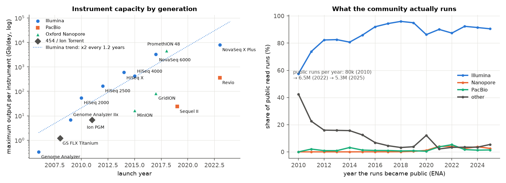\
*Figure A2. Left: vendor-stated maximum output per instrument-day by launch year (log scale), with the Illumina trend. Right: share of public read runs per platform by release year (ENA).*

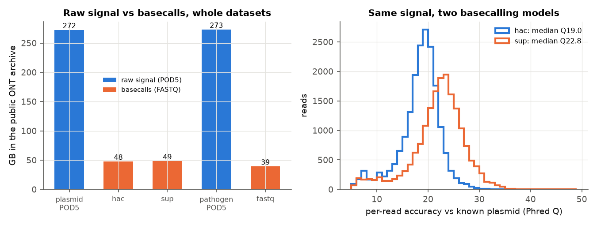\
*Figure B6. Left: total size of raw signal (POD5) and basecalls (FASTQ) in two complete public ONT datasets. Right: per-read accuracy (Phred-scaled identity to the known plasmid sequence) of the same 20,000 signal traces basecalled with the hac and sup models.*

**Table S1. Illumina FASTQ (SRR25629153, both mates, 1.03 GB uncompressed): every codec, lossless round trip verified.**

| codec | ratio | bits/base | compress (MB/s) | decompress (MB/s) | peak memory (MB) |
|---|---|---|---|---|---|
| gzip -6 (the format archives serve) | 4.98× | 4.13 | 16 | 506 | 4 |
| pigz -9, 8 threads | 5.21× | 3.94 | 32 | 444 | 7 |
| bzip2 -9 | 6.24× | 3.29 | 31 | 62 | 8 |
| xz -6, 8 threads | 7.24× | 2.84 | 14 | 1,351 | 991 |
| zstd -3 | 4.71× | 4.36 | **2,282** | 1,194 | 116 |
| zstd -19 | 7.28× | 2.82 | 10 | **1,556** | 1,047 |
| zstd -19 --long=27 (128 MB window) | 12.29× | 1.67 | 8 | 1,316 | 1,294 |
| **Spring** (both mates) | **25.66×** | **0.80** | 99 | 104 | 1,778 |

**Table S2. Nanopore FASTQ (SRR25637822, 1.18 GB uncompressed): every codec, lossless round trip verified.**

| codec | ratio | bits/base | compress (MB/s) | decompress (MB/s) | peak memory (MB) |
|---|---|---|---|---|---|
| gzip -6 (what archives serve) | 2.06× | 7.80 | 13 | 270 | 4 |
| pigz -9, 8 threads | 2.07× | 7.74 | 44 | 265 | 8 |
| bzip2 -9 | 2.43× | 6.59 | 22 | 33 | 8 |
| xz -6, 8 threads | 2.59× | 6.19 | 10 | 591 | 1,086 |
| zstd -3 | 2.04× | 7.86 | **1,239** | 885 | 136 |
| zstd -19 | 2.54× | 6.32 | 7 | 616 | 1,130 |
| zstd -19 --long=27 | 3.05× | 5.25 | 6 | **705** | 1,612 |
| Spring (long-read mode) | **3.18×** | **5.03** | 43 | 46 | 2,722 |

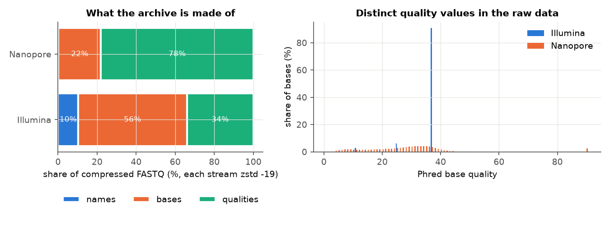\
*Figure B2. Left: share of the compressed FASTQ taken by read names, bases and qualities (each stream zstd -19). Right: distribution of quality values in the raw reads; the Illumina run has four values only.*

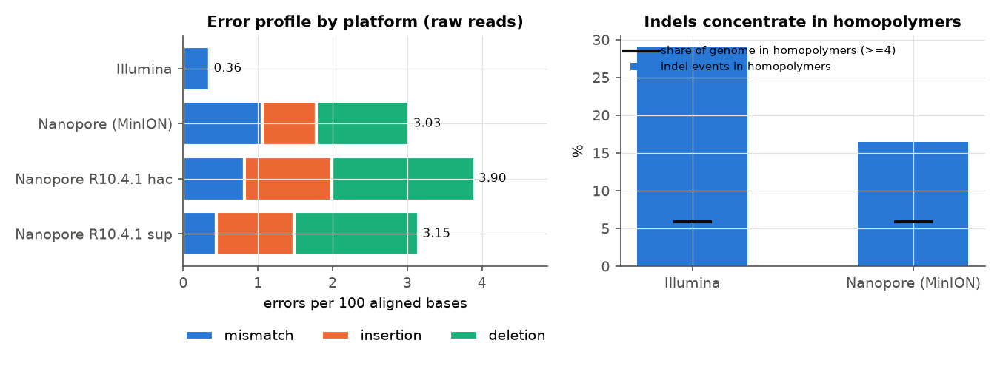\
*Figure B4. Left: errors per 100 aligned bases by type for raw reads aligned to MG1655 (and, for the plasmid POD5 run, after hac and sup basecalling). Right: share of indel events inside homopolymers of ≥4 bases (bars) against the share of the genome in such homopolymers (black line).*

**Data collection for the tiering model.**

**Data at scale.** We took the complete ENA run table for *E. coli* (`tax_tree(562)`).

* *Download.* A single request was silently cut off by the server at 383,280 of ~608,000 rows,
  with no error raised. The fetcher therefore downloads one release year at a time and checks
  each year's row count against ENA's own `/count` endpoint. The result is 607,211 runs, 0.27 PB
  of FASTQ, 9,875 studies, held as Parquet (101 MB TSV → 17 MB).
* *Metadata problems* (`tiering_metadata_issues.tsv`). 261 runs have no study, 2,638 have no
  file size, and 3,751 have zero bases because they were uploaded as native ONT/PacBio files
  that ENA never converted.
* *Labels.* The 5,748 studies released 2010–2021 (155 TB) needed 11,497 Europe PMC queries
  (27.8 min at 8.4 queries/s, resumable cache, 0.6 GB peak memory). 30% of the studies are
  mentioned in at least one paper and 8.0% are reused.

### Engineering and reproducibility

* **One workflow.** Snakemake 9.27 runs about 180 jobs from raw downloads to figures
  (`make repro`). The same rules run on ~14 MB of real data slices in `test_data/`
  (`make test`, no network, no GPU).
* **Pinned environment.** Versions are pinned in `environment.yml`, with the full transitive
  lock in `environment.lock.yml`. Dorado, which is not on conda, is installed by a versioned
  script.
* **Provenance.** Every input is streamed to disk and checked against the archive's MD5 where
  one exists (ENA FASTQ, NCBI SRA file). URL, size, MD5, SHA-256 and UTC retrieval time are
  recorded (`downloads.tsv`). Prices are re-checked against the downloaded AWS price
  list on every run.
* **Scale handling.**
  * Large data never enters git and lives on the Linux filesystem.
  * The 607k-row metadata table is downloaded in verified yearly chunks and stored as Parquet.
  * Europe PMC queries run concurrently (10 threads) through a resumable cache.
  * Read profiling uses one-pass reservoir sampling, so memory stays bounded.
  * Indexes are used instead of scans wherever the format allows (§6).
* **Measured cost.** Every rule has a Snakemake `benchmark:` (wall time, CPU, memory) in
  `results/benchmarks/`. Compression and search benchmarks reserve the whole machine, so
  their timings are not disturbed by parallel jobs.
* **Failure handling.** A truncated download is never accepted: `.part` files, MD5 checks and
  row-count checks against ENA's `/count`. Codec results are verified by a lossless round
  trip.

